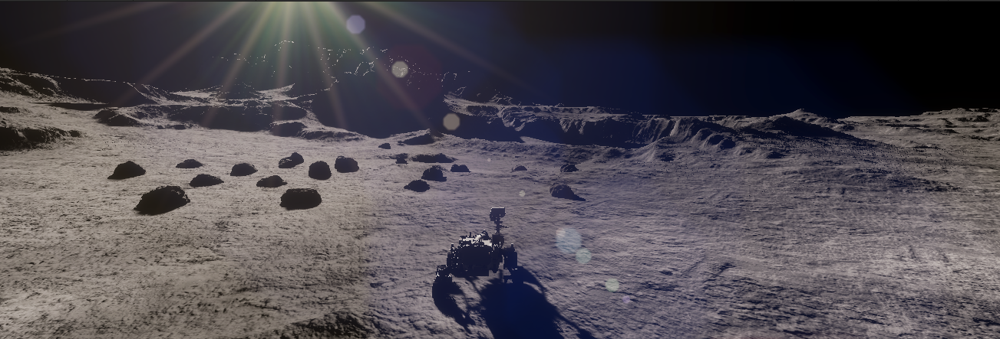
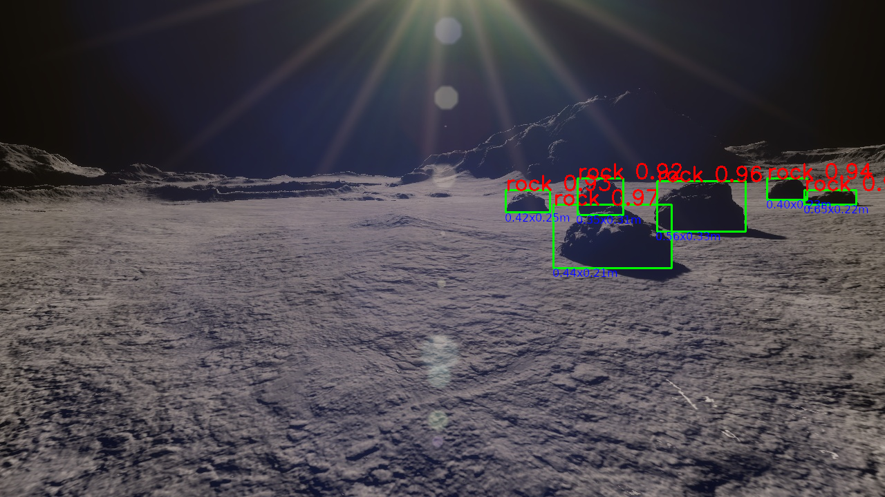
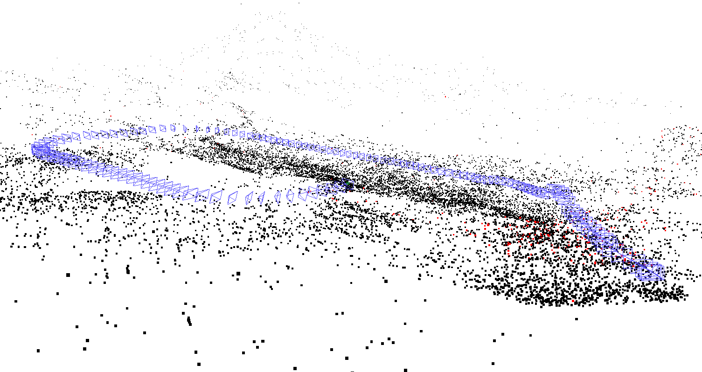
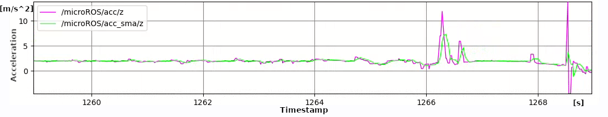
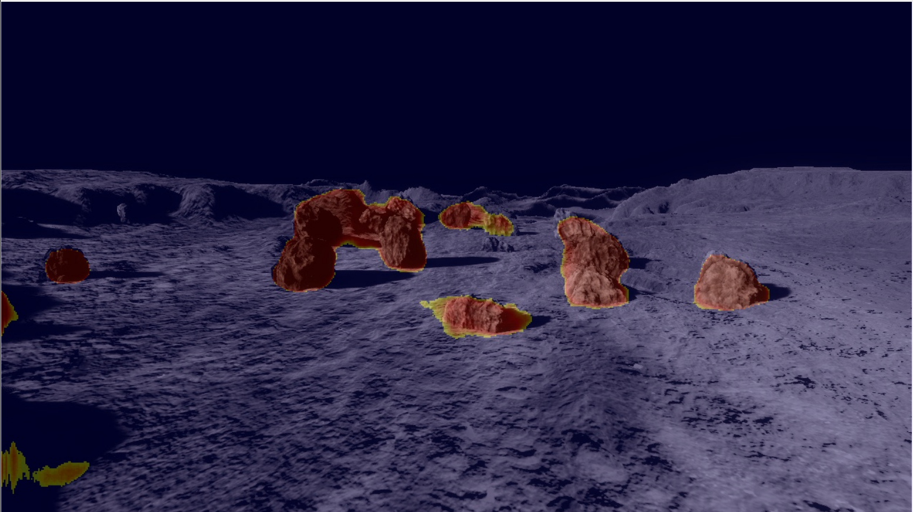

# LunarSim -  ROS 2-Connected Lunar Rover Simulation



## About


## Installation

```bash
# clone the repo
git clone https://github.com/PUTvision/LunarSim

# change the working directory to LunarSim
cd ./LunarSim

# build docker image
docker build -t lunarsim:latest .

# run docker container
bash ./run.sh
```

## Data generation mode

You can find sample image sequences generated with the simulator [here](https://chmura.put.poznan.pl/s/9CQiMdU6O9Olyli).

We also provide our real images recorded during analogue lunar missions ([link](https://chmura.put.poznan.pl/s/HAybyHz1rgpyy9r)). 

## ROS 2 mode

### Topics

#### Subscribed topics

* `/cmd_vel` (geometry_msgs/Twist)

    The velocity command for the robot.

#### Published topics

* `/lunarsim/gt/pose` (geometry_msgs/PoseStamped)

    The ground truth pose of the robot.

* `/lunarsim/imu` (sensor_msgs/Imu)

    The IMU data.

* `/lunarsim/camera_left/raw` (sensor_msgs/Image)

    or

   `/lunarsim/camera_left/compressed` (sensor_msgs/CompressedImage)

    The left camera image.

* `/lunarsim/camera_right/raw` (sensor_msgs/Image)

    or

   `/lunarsim/camera_right/compressed` (sensor_msgs/CompressedImage)

    The right camera image.
    
* `/lunarsim/camera_depth/depth` (sensor_msgs/Image)

    The depth image.


## Examples

* Object detection – embedded device

    ```
    ./examples/jetson_nx_od_yolo
    ```

    

* Visual odometry – x64-based mini-PC

    ```
    ./examples/amd64_stella_vslam
    ```

    

* Simple moving-average filter – microcontroller

    ```
    ./examples/raspberry_pico_smaf
    ```

    

* image segmentation – FPGA

    ```
    ./examples/versal_vck190_segment
    ```

    

## Citation

If you use this code for your research, please cite our paper:

```
SOON
```
